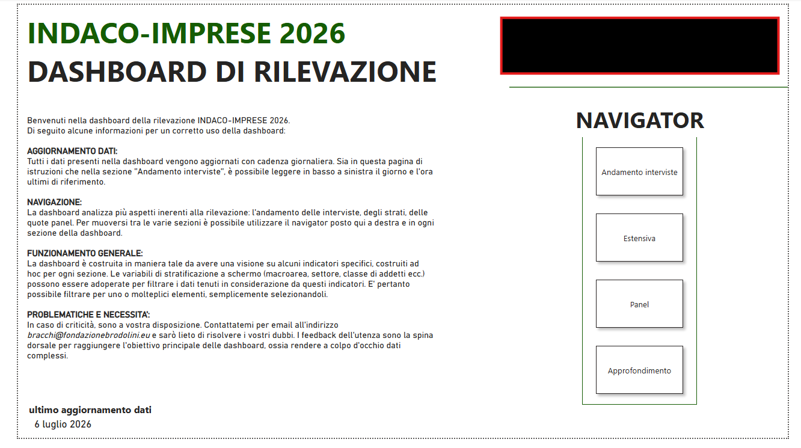
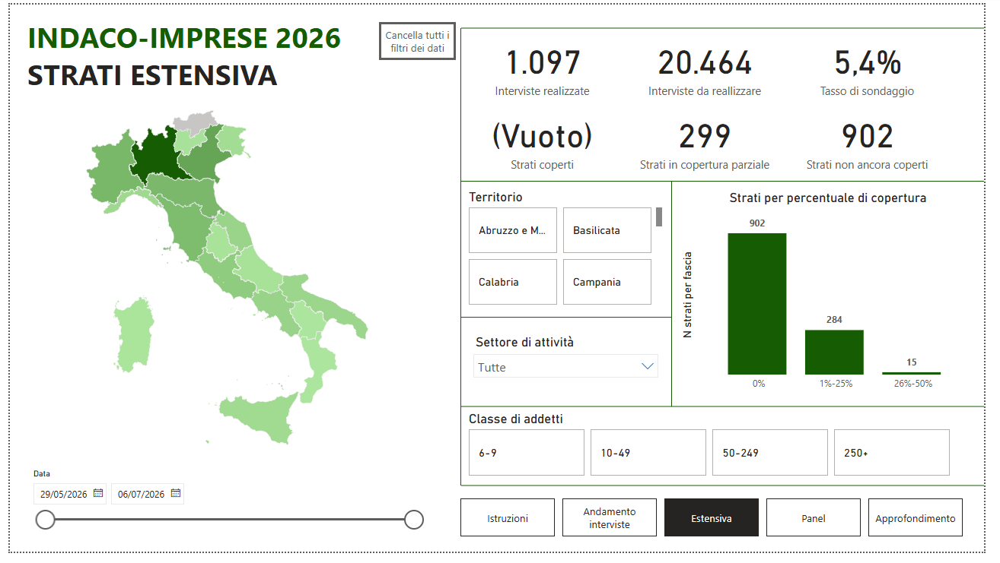
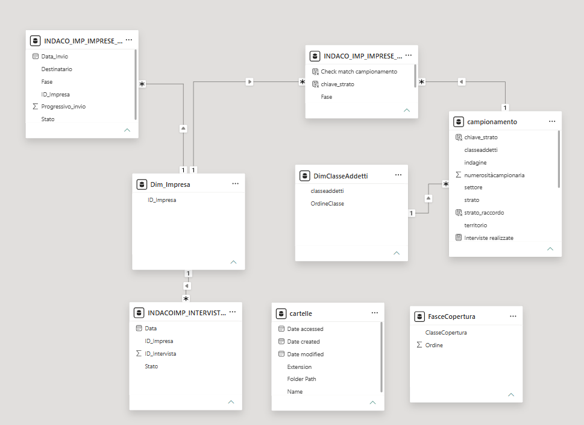

# Fieldwork Monitoring Power BI Dashboard

Power BI dashboard designed to monitor the progress of a complex survey fieldwork process across different survey components, sampling strata and completion levels.

## Project overview

This project presents an interactive Power BI dashboard developed to support the operational monitoring of survey fieldwork activities.

The dashboard integrates multiple data sources and provides a structured view of interview progress, sampling coverage and completion rates.

It was designed to help users quickly identify progress levels, coverage gaps and inconsistencies across linked datasets.

## Objectives

The main objectives of the dashboard are to:

- monitor fieldwork progress across different survey components;
- analyze completion rates by survey type and sampling strata;
- check the coverage of sampling strata;
- compare completed interviews with sampling targets;
- support operational reporting through clear and dynamic indicators;
- provide a structured data model for consistent filtering and analysis.

## Analytical focus

The dashboard focuses on:

- completed interviews;
- completion rates;
- progress by survey component;
- strata coverage;
- company characteristics;
- territorial distribution;
- dynamic filtering by survey type;
- consistency between sampling and interview data.

## Key features

- Interactive filters and slicers
- KPI cards
- Completion rate indicators
- Strata-level monitoring
- Progress classes
- Survey component filtering
- Relational data model
- Operational reporting views

## Tools used

- Power BI
- Power Query
- DAX
- Data modeling
- Data cleaning
- Dashboard design
- Survey monitoring

## Data model

The dashboard is based on a relational data model connecting sampling information, survey components, company identifiers and completed interview records.

The model includes:

- survey-level tables;
- company-level identifiers;
- sampling strata information;
- completed interview records;
- dimensional tables for company size classes;
- coverage classes used for progress monitoring.

Relationships were designed to support filtering by survey component, company characteristics, strata and fieldwork status.

## Screenshots

### Dashboard overview

### Strata coverage

### Data model and relationships

## Skills demonstrated

This project demonstrates skills in:

- Power BI dashboard design;
- Power Query data transformation;
- DAX measure development;
- relational data modeling;
- survey monitoring;
- KPI development;
- sampling strata analysis;
- data consistency checks;
- operational reporting.

## Privacy

The portfolio version is documented using anonymized dashboard screenshots.

The repository does not include raw data, personal data, company-level records or confidential datasets.

## Status

Published as a portfolio case study using anonymized dashboard screenshots.
